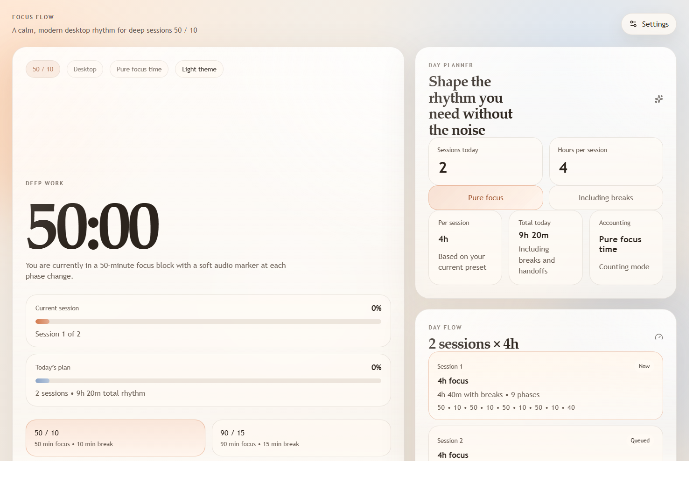
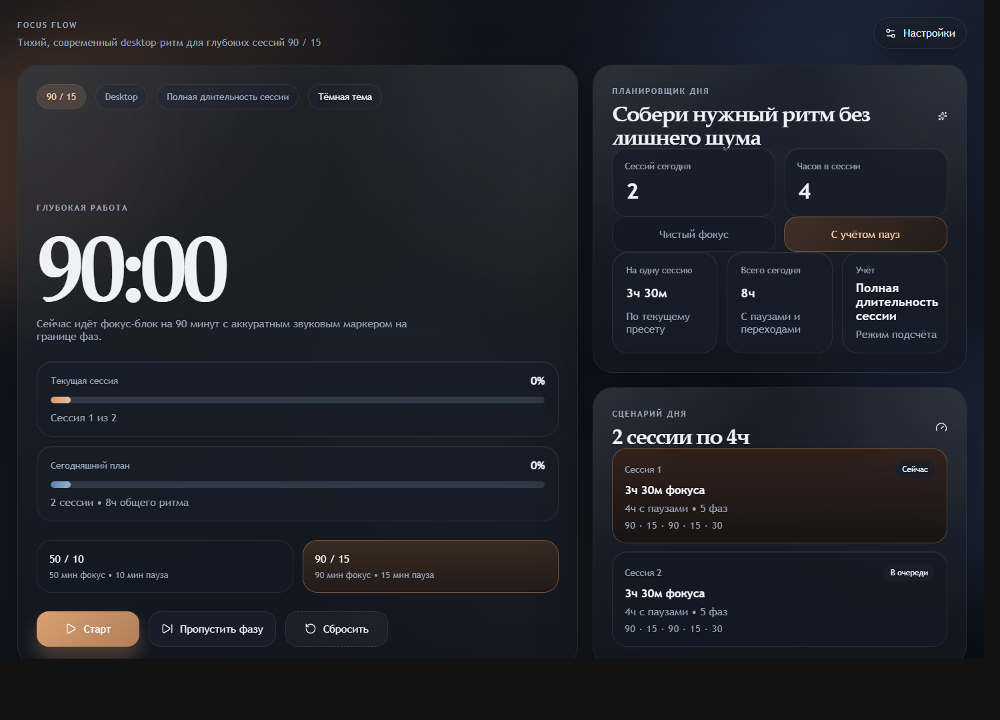

# Focus Flow

<p align="center">
  
</p>

<p align="center">
  A premium desktop focus timer for deep work rituals, calm breaks, and beautifully structured days.
</p>

<p align="center">
  <a href="https://github.com/CaspianG/focus-flow/releases"></a>
  <a href="https://github.com/CaspianG/focus-flow/releases"></a>
  <a href="./LICENSE"></a>
  
</p>

<p align="center">
  50/10 and 90/15 rhythms | session planning | gentle sound cues | Light / Dark / System themes
</p>

<p align="center">
  <a href="https://github.com/CaspianG/focus-flow/releases">Download for Windows</a>
</p>

## Preview




## Why Focus Flow

Focus Flow is a desktop timer for people who want a calm, premium workspace for structured focus. It supports classic `50 / 10` and `90 / 15` rhythms, pleasant audio transitions between phases, and day planning by sessions instead of one endless timer.

If you want to work through `2 sessions x 4 hours`, the app can calculate that day in two ways:

- `Pure focus time`: 4 hours means 4 hours of actual focus, with breaks added on top.
- `Full session length`: 4 hours already includes both focus blocks and breaks.

That choice lives in Settings, so the planner adapts to the way you personally count work.

## Features

- Two deep-work presets: `50 / 10` and `90 / 15`
- Day planning by session count and session duration
- Two accounting modes: `Pure focus time` and `Full session length`
- Language switcher with persisted `English / Russian` UI
- Theme modes: `Light`, `Dark`, and `System`
- Gentle built-in sound cues with two sound profiles: `Dawn` and `Glass`
- Start, pause, skip, and reset controls
- Progress overview for the current block, current session, and the full day
- Persistent local state so your plan survives app restarts
- Packaged as a desktop app with Electron

## Download

The easiest way to use Focus Flow is from the [GitHub Releases](https://github.com/CaspianG/focus-flow/releases) page.

### Windows installer

1. Download `Focus.Flow.Setup.0.2.1.exe` from the latest release.
2. Run the installer.
3. Launch `Focus Flow` from the Start menu or desktop shortcut.

### Portable build

If you prefer to run it without installation, download `Focus.Flow.Portable.0.2.1.zip`, extract it, and open `Focus Flow.exe`.

## Interface Language

Focus Flow opens in `English` by default for new installs. If you switch the interface to `Russian` in Settings, that choice is saved locally and restored automatically on future launches.

## Create A Desktop Shortcut

If Windows does not create a shortcut automatically:

1. Open the installed app folder or the unpacked portable folder.
2. Right-click `Focus Flow.exe`.
3. Choose `Send to` -> `Desktop (create shortcut)`.

If you are running a local build from this repository, the executable is usually at:

`release/win-unpacked/Focus Flow.exe`

## Tech Stack

- Electron
- React 19
- TypeScript
- Vite
- Framer Motion
- Vitest

## Local Development

```bash
npm install
npm run dev
```

## Build

```bash
npm run dist
```

This creates release artifacts in the `release/` directory.

## Testing

```bash
npm test
```

## Project Structure

```text
electron/              Electron main and preload processes
src/App.tsx            Main desktop UI
src/hooks/             App state and timer hooks
src/lib/               Planner, timer, sound, storage, and localization logic
src/styles.css         Visual system and theme tokens
docs/screenshots/      README screenshots and GitHub visual assets
build/                 Packaged app icon sources
```

## License

Released under the [MIT License](./LICENSE).

## Notes

- Windows is the primary verified target right now.
- macOS and Linux targets are configured in Electron Builder, but they still need real-device verification and signing before public distribution.
